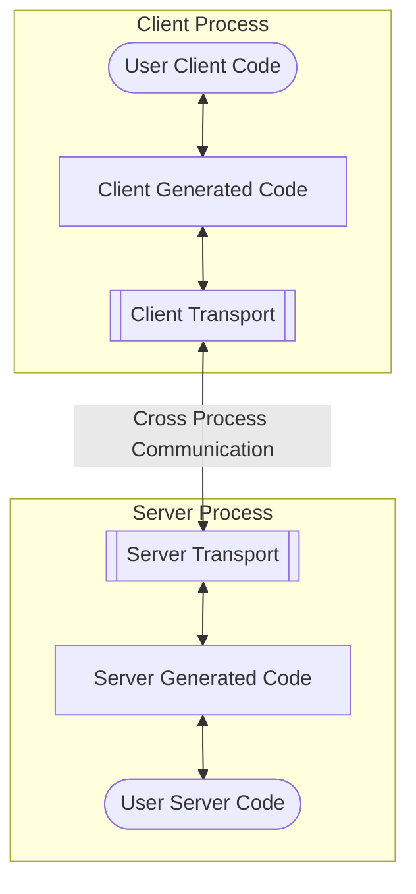

# tRIG
Transport library to support [bigRIG generated code](https://github.com/jpg85/bigRIG)

While bigRIG is used to generate the boiler-plate code to enable cross-language, cross-process, and cross-machine code, tRIG enables the actual transport of the data. It is the piece in the middle of it all.

The transport library is planned to support the following languages:

1. C++
2. C#
3. Python

To communicate, it uses the following:

1. ZMQ
2. In-process memory

The second option makes tRIG operate very much like SWIG where it simply enables communication between different programming languages.

Finally, a "Common" library exists, written with a C interface, that allows shared code between languages.